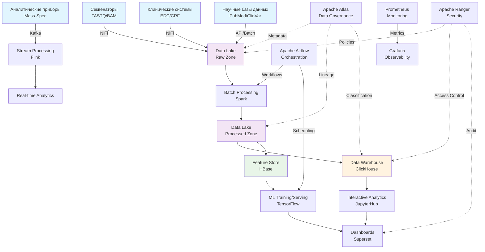

<div align="center">

ДЕПАРТАМЕНТ ОБРАЗОВАНИЯ ГОРОДА МОСКВЫ  
ГОСУДАРСТВЕННОЕ АВТОНОМНОЕ ОБРАЗОВАТЕЛЬНОЕ УЧРЕЖДЕНИЕ  
ВЫСШЕГО ОБРАЗОВАНИЯ ГОРОДА МОСКВЫ  
«МОСКОВСКИЙ ГОРОДСКОЙ ПЕДАГОГИЧЕСКИЙ УНИВЕРСИТЕТ»  
ИНСТИТУТ ЦИФРОВОГО ОБРАЗОВАНИЯ  
ДЕПАРТАМЕНТ ИНФОРМАТИКИ, УПРАВЛЕНИЯ И ТЕХНОЛОГИЙ  

<br/>
<br/>

<strong>Лабораторная работа по</strong><br/>
<strong>«Инструменты для хранения и обработки больших данных»</strong>  

<br/>
<br/>
<br/>
<br/>
<br/>
<br/>
<br/>
<br/>
<br/>
<br/>
<br/>
<br/>
<br/>
<br/>

<div align="right" style="margin-left: 20%;">

<strong>Выполнил:</strong> Семеняченко Данил Юрьевич<br/>
<strong>Проверил:</strong> Босенко Тимур Муртазович  

<br/>

<strong>Курс обучения:</strong> 3<br/>
<strong>Форма обучения:</strong> очная  

<br/>

<strong>Москва 2025</strong>

</div>
</div>

<div align="center">

<b>ДЕПАРТАМЕНТ ОБРАЗОВАНИЯ ГОРОДА МОСКВЫ</b><br/>
<b>ГОСУДАРСТВЕННОЕ АВТОНОМНОЕ ОБРАЗОВАТЕЛЬНОЕ УЧРЕЖДЕНИЕ</b><br/>
<b>ВЫСШЕГО ОБРАЗОВАНИЯ ГОРОДА МОСКВЫ</b><br/>
<b>«МОСКОВСКИЙ ГОРОДСКОЙ ПЕДАГОГИЧЕСКИЙ УНИВЕРСИТЕТ»</b><br/>
<b>ИНСТИТУТ ЦИФРОВОГО ОБРАЗОВАНИЯ</b><br/>
<b>ДЕПАРТАМЕНТ ИНФОРМАТИКИ, УПРАВЛЕНИЯ И ТЕХНОЛОГИЙ</b><br/>

<br/><br/>

<b>Лабораторная работа по</b><br/>
<b>«Инструменты для хранения и обработки больших данных»</b><br/>
<b>Лабораторная работа 3-1</b><br/>

<br/><br/>

<table width="100%" style="border: none;">
<tr>
<td width="50%" align="left" style="border: none;">
<b>Выполнил:</b><br/>
студент курса 3, очная форма<br/>
<b>Семеняченко Данил Юрьевич</b><br/>
</td>
<td width="50%" align="left" style="border: none;">
<b>Проверил:</b><br/>
<b>Босенко Тимур Муртазович</b><br/>
</td>
</tr>
</table>

<br/><br/><br/>

<b>Москва 2025</b>

</div>

---

# Лабораторная работа 3-1. Проектирование архитектуры хранилища больших данных

## Тема
Разработка архитектуры хранилища больших данных для биотехнологической компании, специализирующейся на анализе геномных последовательностей и клинических исследований.

## Цель работы
Разработать комплексную архитектуру хранилища больших данных для предложенного бизнес-сценария, обосновать выбор технологического стека и визуализировать потоки данных.

## Бизнес-контекст
**Биотехнологическая компания** со следующими основными задачами:
- Анализ геномных последовательностей (NGS - Next Generation Sequencing)
- Поиск паттернов в данных клинических исследований  
- Моделирование лекарственного взаимодействия

**Основные источники данных:**
- Данные секвенирования (FASTQ, BAM, VCF файлы)
- Данные клинических испытаний
- Научные базы данных и публикации
- Данные с аналитического оборудования

---

## Шаг 1. Определение требований к хранилищу

### 1.1 Объем данных
- **Ожидаемый начальный объем:** 50-100 ТБ в год
- **Прогнозируемый рост:** 30-50% ежегодно
- **Обоснование:** Один запуск современного секвенатора (например, Illumina NovaSeq) может генерировать до 6 ТБ данных. При активной исследовательской деятельности объемы быстро накапливаются.

Современные технологии секвенирования нового поколения (NGS) произвели революцию в биотехнологической отрасли, но одновременно создали беспрецедентные вызовы в области управления данными. Каждый эксперимент секвенирования генерирует огромные объемы данных, начиная от сырых последовательностей в формате FASTQ и заканчивая выровненными данными в формате BAM и аннотированными геномными вариантами в формате VCF. При начальном объеме 50-100 ТБ в год и прогнозируемом росте 30-50% ежегодно, компания должна быть готова к обработке и хранению нескольких петабайт данных в течение следующих 3-5 лет. Такой экспоненциальный рост требует не просто масштабируемой архитектуры, но и интеллектуальных стратегий управления жизненным циклом данных, включая политики архивирования и удаления устаревших данных.

### 1.2 Скорость получения данных
- **Данные секвенирования (NGS):** Поступление пакетами по завершении циклов секвенирования. Размер пакетов - от 100 ГБ до 2 ТБ. Частота - несколько раз в неделю.
- **Клинические данные:** Ежедневные/еженедельные пакетные обновления от исследовательских центров. Включают структурированные данные (CRF - Case Report Forms) и медицинские изображения.
- **Потоковые данные с аналитических приборов:** Данные в режиме, близком к реальному времени, с масс-спектрометров, хроматографов и других биохимических анализаторов.
- **Научные базы данных:** Еженедельные/ежемесячные обновления справочных данных из PubMed, ClinVar, UniProt.

Разнообразие скоростей поступления данных создает уникальные требования к архитектуре хранилища. Пакетные поступления данных NGS требуют оптимизированных пайплайнов для обработки больших файлов, в то время как потоковые данные с аналитических приборов нуждаются в системах реального времени для немедленного анализа и реагирования. Клинические данные, часто содержащие критически важную информацию о пациентах, должны обрабатываться с соблюдением строгих протоколов безопасности и конфиденциальности. Научные базы данных, хотя и обновляются реже, требуют сложных механизмов интеграции и согласования данных из разнородных источников.

### 1.3 Типы данных
| Тип данных | Примеры | Доля | Особенности хранения |
|------------|---------|------|---------------------|
| **Структурированные** | Данные клинических испытаний, демография пациентов, метаданные экспериментов | 15% | Реляционные БД, табличные форматы |
| **Полуструктурированные** | FASTQ, BAM, VCF файлы; JSON/XML из API; логи обработки | 60% | Файловое хранилище с метаданными |
| **Неструктурированные** | Изображения (микроскопия, МРТ), PDF-отчеты, научные публикации, эталонные геномы (FASTA) | 25% | Объектное хранилище |

Преобладание полуструктурированных данных (60%) отражает специфику биотехнологической отрасли, где стандартизированные форматы вроде FASTQ, BAM и VCF доминируют в обмене геномной информацией. Эти форматы, хотя и следуют определенным стандартам, требуют специализированных инструментов для обработки и анализа. Структурированные данные, хотя и составляют меньшую долю, являются критически важными для клинических исследований и регуляторной отчетности. Неструктурированные данные, включая медицинские изображения и научные публикации, добавляют дополнительный уровень сложности, требуя систем, способных эффективно хранить и индексировать разнородный контент.

### 1.4 Требования к обработке данных
- **Препроцессинг NGS-данных:** Контроль качества, выравнивание на референсный геном - ежедневно при поступлении данных
- **Вызов геномных вариантов (Variant Calling):** Пакетная обработка с помощью инструментов типа GATK, Sentieon
- **Интегративный анализ:** Объединение геномных и клинических данных для поиска биомаркеров - ежеквартально
- **Моделирование молекулярной динамики:** Вычислительно интенсивные задачи по требованию
- **Оперативная аналитика:** Поиск патогенных мутаций по запросу исследователя - время ответа < 10 минут
- **Регуляторная отчетность:** Подготовка данных для ФСИ, FDA - ежемесячно/ежеквартально

Требования к обработке данных охватывают широкий спектр вычислительных парадигм - от пакетной обработки больших объемов данных до интерактивных запросов в реальном времени. Препроцессинг NGS-данных является наиболее ресурсоемкой задачей, требующей высокопроизводительных вычислительных кластеров и оптимизированных алгоритмов. Вызов геномных вариантов представляет собой сложный биоинформатический процесс, часто требующий специализированного оборудования и программного обеспечения. Интегративный анализ, сочетающий геномные и клинические данные, является ключевым для персонализированной медицины, но создает значительные вызовы в области интеграции данных и обеспечения их качества.

### 1.5 Требования к доступности данных
- **Время отклика для интерактивных запросов:** < 1 минуты для агрегированных данных
- **Время отклика для сложных аналитических запросов:** < 10 минут
- **Доступность аналитических платформ:** 99.9% (≈8.8 часов простоя в год)
- **Восстановление после сбоев:** Для сырых данных - до 24 часов, для аналитических данных - до 4 часов

Требования к доступности отражают критическую важность данных для исследовательской деятельности компании. Время отклика для интерактивных запросов должно быть минимальным, чтобы исследователи могли быстро проверять гипотезы и получать insights. Высокая доступность платформ (99.9%) необходима для обеспечения непрерывности исследований, при этом стратегии восстановления после сбоев дифференцированы в зависимости от типа данных - сырые данные могут восстанавливаться дольше, тогда как аналитические данные, используемые в текущих исследованиях, требуют быстрого восстановления.

### 1.6 Требования к безопасности данных
- **Обязательное шифрование:** Данных в состоянии покоя (at-rest) и при передаче (in-transit)
- **Строгий контроль доступа:** RBAC (Role-Based Access Control) с многофакторной аутентификацией
- **Детальный аудит:** Логирование всех операций доступа и модификации данных
- **Соответствие регуляторным требованиям:** 152-ФЗ "О персональных данных", HIPAA, GDPR
- **Анонимизация данных:** Псевдонимизация персональных данных пациентов на ранних этапах обработки

Безопасность данных является абсолютным приоритетом, учитывая чувствительный характер геномной и клинической информации. Требования включают многоуровневую защиту, начиная от криптографического шифрования и заканчивая сложными системами контроля доступа. Соответствие международным стандартам и регуляторным требованиям (152-ФЗ, HIPAA, GDPR) обязательно для биотехнологических компаний, работающих с персональными данными пациентов. Анонимизация и псевдонимизация данных должны быть встроены в процессы обработки с самого начала, чтобы минимизировать риски раскрытия конфиденциальной информации.

## Шаг 2. Выбор модели хранилища данных

Для данного сценария выбрана **гибридная модель (Data Lake + Data Warehouse + Feature Store)** с обоснованием:

### Data Lake (озеро данных)
**Назначение:** Хранение сырых, необработанных данных в первоначальном формате
- **Преимущества:** Сохранение всей информации, гибкость форматов, cost-effective хранение
- **Технологии:** HDFS / Объектное хранилище (S3-совместимое)
- **Хранимые данные:** Исходные FASTQ, BAM файлы, сырые клинические данные, медицинские изображения

Data Lake служит фундаментальным слоем хранения, где сохраняются все исходные данные в их первоначальном формате. Это критически важно для биотехнологических исследований, где методы анализа постоянно развиваются, и возможность повторной обработки исходных данных с использованием новых алгоритмов может привести к новым научным открытиям. Data Lake обеспечивает гибкость хранения разнородных данных без необходимости немедленной трансформации, что позволяет исследователям работать с данными в их наиболее информативной форме. Использование объектного хранилища S3-совместимого типа обеспечивает cost-effective решение для хранения больших объемов данных при сохранении высокой доступности и долговечности.

### Data Warehouse (хранилище данных)
**Назначение:** Хранение очищенных, структурированных данных, оптимизированных для аналитики
- **Преимущества:** Высокая производительность запросов, строгая схема данных, поддержка SQL
- **Технологии:** ClickHouse / Amazon Redshift / Google BigQuery
- **Хранимые данные:** Аннотированные геномные варианты (VCF), агрегированные клинические показатели

Data Warehouse строится поверх Data Lake и содержит тщательно очищенные, структурированные и оптимизированные для аналитики данные. В контексте биотехнологической компании, это включает аннотированные геномные варианты, нормализованные клинические показатели и агрегированные исследовательские метрики. Выбор колоночных хранилищ данных типа ClickHouse обусловлен их превосходной производительностью при выполнении аналитических запросов, которые обычно включают агрегации и сканирования больших объемов данных. Строгая схема данных обеспечивает согласованность и качество данных, что критически важно для научных исследований и регуляторной отчетности.

### Feature Store (хранилище признаков)
**Назначение:** Хранение готовых признаков для машинного обучения
- **Преимущества:** Ускорение разработки ML-моделей, воспроизводимость экспериментов
- **Технологии:** Apache HBase / Redis / Feast
- **Хранимые данные:** Векторизованные представления геномных вариантов, нормализованные клинические параметры

Feature Store представляет собой специализированный слой для машинного обучения, где хранятся предварительно обработанные и инженерные признаки. В биотехнологическом контексте это включает векторизованные представления геномных последовательностей, нормализованные выражения генов, энкодированные биологические pathway и другие features, используемые для тренировки ML-моделей. Наличие отдельного Feature Store значительно ускоряет итерации в разработке ML-моделей, обеспечивает воспроизводимость экспериментов и согласованность признаков между тренировкой и инференсом. Технологии типа Apache HBase обеспечивают низколатентный доступ к признакам, что важно для реального времени инференса в клинических приложениях.

---

## Архитектура хранилища больших данных

### 2.1 Детализированная архитектура компонентов

#### Слой источников данных
```
┌─────────────────┐    ┌──────────────────┐    ┌────────────────────┐
│   Секвенаторы   │    │ Клинические      │    │ Научные базы данных│
│ (Illumina,      │    │ системы (EDC)    │    │ (PubMed, ClinVar,  │
│ PacBio, Oxford  │    │                  │    │ UniProt, COSMIC)   │
│ Nanopore)       │    │                  │    │                    │
│                 │    │                  │    │                    │
│ • FASTQ files   │    │ • CRF data       │    │ • Reference data   │
│ • BAM alignment │    │ • Patient records│    │ • Annotations      │
│ • VCF variants  │    │ • Medical images │    │ • Publications     │
└─────────────────┘    └──────────────────┘    └────────────────────┘
         ↓                       ↓                          ↓
    ┌─────────────────────────────────────────────────────────────┐
    │                  СЛОЙ ПРИЕМА ДАННЫХ                         │
    └─────────────────────────────────────────────────────────────┘
```

Слой источников данных представляет собой разнородную экосистему оборудования и систем, генерирующих данные. Современные секвенаторы, такие как Illumina NovaSeq, PacBio Sequel и Oxford Nanopore, производят данные в специализированных форматах, требующих специфических протоколов передачи и обработки. Клинические системы, включая Electronic Data Capture (EDC) системы, содержат структурированные данные клинических испытаний, демографическую информацию пациентов и медицинские изображения. Научные базы данных предоставляют справочную информацию, такую как аннотации генов, известные патогенные варианты и биологические pathway, которые необходимы для интерпретации геномных данных.

#### Слой приема и передачи данных (Ingestion Layer)
**Apache NiFi**
- **Роль:** Управление потоком данных, гарантированная доставка, базовые трансформации
- **Преимущества:** Визуальное программирование, поддержка 200+ коннекторов, мониторинг в реальном времени
- **Использование:** Прием больших файлов FASTQ/BAM из секвенаторов, интеграция с EDC-системами

Apache NiFi служит центральным узлом для приема и распределения данных в архитектуре. Его визуальный интерфейс позволяет легко конфигурировать сложные потоки данных, обеспечивая при этом надежную доставку даже в условиях сетевых сбоев или временной недоступности систем-источников. Для больших файлов NGS-данных NiFi обеспечивает оптимизированную передачу с проверкой целостности и возможностью возобновления при обрывах. Интеграция с EDC-системами осуществляется через стандартные протоколы (HL7 FHIR, CDISC) с трансформацией данных в единый внутренний формат.

**Apache Kafka**
- **Роль:** Шина данных для потоковой обработки
- **Преимущества:** Высокая пропускная способность, отказоустойчивость, сохранение порядка сообщений
- **Использование:** Обработка данных с аналитических приборов в реальном времени, событийные уведомления

Apache Kafka функционирует как высокопроизводительная шина данных для потоковой обработки. Она обеспечивает буферизацию данных с аналитических приборов, которые работают в режиме, близком к реальному времени, таких как масс-спектрометры и хроматографы. Kafka гарантирует сохранение порядка сообщений и обеспечивает механизмы повторной обработки данных, что критически важно для научных экспериментов, где последовательность измерений имеет значение. Событийная архитектура на основе Kafka позволяет различным компонентам системы реагировать на изменения данных в реальном времени.

#### Слой хранения данных (Storage Layer)
**Объектное хранилище (S3-совместимое)**
```yaml
Data_Lake:
  raw_zone:
    - ngs/raw_fastq/
    - clinical/source_data/
    - imaging/raw_images/
  processed_zone:
    - ngs/processed_bam/
    - clinical/cleaned_data/
    - variants/annotated_vcf/
  analytics_zone:
    - features/ml_ready/
    - aggregates/reports/
```

Объектное хранилище организовано в виде зон, отражающих различные стадии обработки данных. Raw Zone содержит исходные данные в неизменном виде, что обеспечивает воспроизводимость исследований и соответствует регуляторным требованиям к хранению исходных данных. Processed Zone содержит данные, прошедшие первичную обработку - выровненные последовательности, аннотированные варианты, очищенные клинические данные. Analytics Zone предназначена для данных, готовых к непосредственному анализу - инженерных признаков для ML, агрегированных показателей для отчетности. Такая организация обеспечивает четкое разделение ответственности и управление доступом на разных стадиях обработки.

**Data Warehouse (ClickHouse)**
- **Архитектура:** Column-oriented, распределенная кластерная архитектура
- **Оптимизация:** Для аналитических запросов с агрегациями и JOIN больших таблиц
- **Пример схемы:**
```sql
CREATE TABLE genomic_variants (
    sample_id String,
    chromosome String,
    position UInt32,
    reference String,
    alternate String,
    quality Float32,
    filter String,
    annotations Nested(
        key String,
        value String
    ),
    clinical_significance Enum8('Benign'=1, 'Likely_benign'=2, 'VUS'=3, 'Likely_pathogenic'=4, 'Pathogenic'=5),
    created_date Date DEFAULT today()
) ENGINE = MergeTree()
PARTITION BY toYYYYMM(created_date)
ORDER BY (chromosome, position, sample_id);
```

ClickHouse обеспечивает высокопроизводительное хранение и обработку структурированных данных. Колоночная организация данных особенно эффективна для аналитических запросов, которые typically затрагивают подмножества колонок из больших таблиц. Распределенная архитектура позволяет масштабировать хранилище горизонтально, добавляя новые узлы по мере роста объемов данных. Схема данных оптимизирована для типичных запросов в геномных исследованиях - фильтрация по хромосоме и позиции, агрегация по образцам, поиск патогенных вариантов. Партиционирование по дате обеспечивает эффективное управление жизненным циклом данных и оптимизацию запросов по временным диапазонам.

**Feature Store (Apache HBase)**
- **Модель данных:** Wide-column store с быстрым случайным доступом
- **Использование:** Обслуживание признаков для ML-моделей в инференсе
- **Схема доступа:** REST API или нативные клиенты для Python/Java

Apache HBase предоставляет низколатентный доступ к признакам для ML-моделей, что критически важно для приложений реального времени, таких как клиническая диагностика или скрининг лекарственных соединений. Wide-column модель данных позволяет гибко хранить разнородные признаки - от числовых векторов до разреженных матриц и бинарных данных. REST API обеспечивает унифицированный интерфейс доступа для различных языков программирования и инструментов, используемых в исследовательском процессе.

#### Слой обработки данных (Processing Layer)
**Apache Spark**
```python
# Пример пайплайна обработки NGS данных
def process_ngs_pipeline(fastq_path, output_path):
    return (
        spark.read.format("fastq")
        .load(fastq_path)
        .transform(quality_control)          # Контроль качества
        .transform(alignment_to_reference)   # Выравнивание на референс
        .transform(variant_calling)          # Вызов вариантов
        .transform(annotation)               # Функциональная аннотация
        .write.format("parquet")
        .save(output_path)
    )
```

Apache Spark служит основным движком для пакетной обработки данных, особенно для вычислительно интенсивных задач анализа NGS-данных. Его распределенная архитектура позволяет эффективно обрабатывать терабайты данных, распределяя вычисления across кластеру узлов. Библиотеки вроде ADAM предоставляют специализированные функции для работы с геномными данными, интегрируясь со стандартными биоинформатическими инструментами. Поддержка различных форматов данных (FASTQ, BAM, VCF) через специализированные коннекторы делает Spark идеальным выбором для построения комплексных пайплайнов обработки геномных данных.

**Apache Flink**
- **Применение:** Обработка потоковых данных с масс-спектрометров
- **Преимущества:** Exactly-once семантика, низкая latency
- **Use case:** Мониторинг качества экспериментов в реальном времени

Apache Flink дополняет Spark, обеспечивая возможности потоковой обработки с гарантированной доставкой и обработкой (exactly-once semantics). Это критически важно для мониторинга аналитических приборов в реальном времени, где необходимо немедленно обнаруживать аномалии в данных или изменения в качестве измерений. Низкая latency обработки позволяет исследователям получать feedback о ходе экспериментов практически в реальном времени, что может значительно ускорить процесс исследований и снизить стоимость ошибок.

#### Слой оркестрации (Orchestration Layer)
**Apache Airflow**
```python
# DAG для полного пайплайна анализа
with DAG('ngs_processing_pipeline', 
         schedule_interval='@daily',
         default_args=default_args) as dag:
    
    extract_task = PythonOperator(
        task_id='extract_raw_data',
        python_callable=extract_from_sources
    )
    
    qc_task = SparkSubmitOperator(
        task_id='quality_control',
        application='apps/quality_control.py'
    )
    
    alignment_task = SparkSubmitOperator(
        task_id='genome_alignment',
        application='apps/alignment.py'
    )
    
    variant_calling_task = SparkSubmitOperator(
        task_id='variant_calling',
        application='apps/variant_calling.py'
    )
    
    load_task = PythonOperator(
        task_id='load_to_dwh',
        python_callable=load_to_data_warehouse
    )
    
    extract_task >> qc_task >> alignment_task >> variant_calling_task >> load_task
```

Apache Airflow обеспечивает координацию и оркестрацию сложных многокомпонентных пайплайнов обработки данных. Его декларативный подход к определению workflows позволяет легко описывать зависимости между задачами, обрабатывать ошибки и перезапускать failed tasks. В контексте биотехнологической компании, Airflow управляет всем жизненным циклом данных - от приема сырых данных с секвенаторов до генерации отчетов для регуляторов. Мониторинг выполнения пайплайнов и alerting обеспечивают оперативное реагирование на проблемы, что критически важно для соблюдения timelines исследований.

#### Слой аналитики и ML (Analytics & ML Layer)
**JupyterHub**
- **Назначение:** Интерактивная аналитика и прототипирование алгоритмов
- **Интеграция:** Подключение к Spark, доступ к данным через SQL
- **Безопасность:** Изоляция окружений между исследователями

JupyterHub предоставляет интерактивную среду для исследователей, позволяя им работать с данными используя привычные инструменты (Python, R) без необходимости глубоких знаний о нижележащей инфраструктуре. Интеграция с Spark позволяет выполнять распределенные вычисления непосредственно из ноутбуков, в то время как подключение к Data Warehouse через SQL обеспечивает быстрый доступ к агрегированным данным. Изоляция окружений между пользователями гарантирует безопасность и воспроизводимость исследований, а также предотвращает конфликты зависимостей и версий библиотек.

**ML Platform (TensorFlow/PyTorch)**
```python
# Пример тренировки модели для предсказания патогенности
class VariantClassifier(nn.Module):
    def __init__(self, input_dim, hidden_dim, num_classes):
        super().__init__()
        self.encoder = nn.Sequential(
            nn.Linear(input_dim, hidden_dim),
            nn.ReLU(),
            nn.Dropout(0.3),
            nn.Linear(hidden_dim, hidden_dim//2),
            nn.ReLU()
        )
        self.classifier = nn.Linear(hidden_dim//2, num_classes)
    
    def forward(self, x):
        encoded = self.encoder(x)
        return self.classifier(encoded)

# Загрузка признаков из Feature Store
features = feature_store.get_features(
    variant_ids=variant_list,
    feature_names=['conservation', 'functional_impact', 'population_frequency']
)
```

Платформа машинного обучения обеспечивает инфраструктуру для разработки, тренировки и развертывания ML-моделей для различных биотехнологических задач - от предсказания патогенности геномных вариантов до дизайна лекарственных молекул. Интеграция с Feature Store гарантирует согласованность признаков между тренировкой и инференсом, что критически важно для качества моделей. Поддержка распределенной тренировки на GPU-кластерах позволяет работать с большими моделями и datasets, что особенно актуально для deep learning подходов в обработке геномных данных.

#### Слой визуализации (Visualization Layer)
**Apache Superset**
- **Дашборды:** Мониторинг качества данных, отчеты по клиническим исследованиям
- **Интеграция:** Прямое подключение к ClickHouse, PostgreSQL
- **Безопасность:** Row-level security, RBAC

Apache Superset предоставляет мощные возможности визуализации и построения дашбордов для различных стейкхолдеров - от исследователей до менеджеров и регуляторов. Дашборды мониторинга качества данных позволяют отслеживать метрики входящих данных и вовремя обнаруживать проблемы. Отчеты по клиническим исследованиям обеспечивают прозрачность и traceability всего исследовательского процесса. Row-level security гарантирует, что пользователи видят только те данные, к которым у них есть доступ, что критически важно для соблюдения конфиденциальности пациентов и коммерческой тайны.

### 2.2 Сквозные сервисы (Cross-cutting Concerns)

#### Управление данными и метаданными
**Apache Atlas**
- **Data Catalog:** Поиск и обнаружение datasets
- **Data Lineage:** Отслеживание происхождения данных от секвенатора до отчета
- **Классификация данных:** Автоматическое tagging ПДн, коммерческой тайны

Apache Atlas обеспечивает комплексное управление метаданными и governance across всей архитектуры. Data Catalog позволяет исследователям легко находить нужные datasets через поиск по метаданным, тегам и аннотациям. Data Lineage отслеживает происхождение данных на всех этапах обработки, что критически важно для воспроизводимости исследований и регуляторного соответствия. Автоматическая классификация данных помогает применять соответствующие политики безопасности к различным типам данных, особенно к персональным данным пациентов и коммерческой тайне.

#### Безопасность и контроль доступа
**Apache Ranger**
```yaml
Policies:
  - name: "Clinical Researchers Access"
    resources:
      - database: clinical
      - table: patient_records
    permissions:
      - user: "research_group"
        access: ["select"]
    conditions:
      - "masking: pseudonymize(patient_id)"
    
  - name: "Bioinformaticians Access"
    resources:
      - path: "/data_lake/raw/ngs/*"
    permissions:
      - group: "bioinformatics"
        access: ["read", "write"]
```

Apache Ranger предоставляет централизованное управление безопасностью и доступом across всех компонентов архитектуры. Политики доступа определяются на основе ролей пользователей и чувствительности данных, с автоматическим применением масок и фильтров для конфиденциальной информации. Детальный аудит всех операций доступа обеспечивает полную traceability и помогает в расследовании инцидентов безопасности. Интеграция с корпоративными системами аутентификации (LDAP/AD) упрощает управление пользователями и их правами.

#### Мониторинг и observability
**Stack: Prometheus + Grafana**
- **Метрики:** Производительность кластера, объемы данных, качество обработки
- **Alerting:** Автоматические оповещения о проблемах в пайплайнах
- **Логи:** Централизованный сбор и анализ логов всех компонентов

Комплексная система мониторинга на основе Prometheus и Grafana обеспечивает observability всей архитектуры. Метрики производительности помогают оптимизировать использование ресурсов и вовремя обнаруживать bottlenecks. Мониторинг качества данных позволяет отслеживать completeness, accuracy и consistency данных на всех этапах обработки. Автоматические alerting уведомляют команду о проблемах до того, как они повлияют на исследования. Централизованный сбор логов обеспечивает быструю диагностику проблем и анализ инцидентов.

## 3. Схема архитектуры (Data Flow)



Данная схема иллюстрирует полный поток данных через архитектуру, начиная от разнородных источников и заканчивая аналитическими приложениями. Потоки данных четко разделены по типам обработки - пакетная обработка больших объемов через Spark, потоковая обработка в реальном времени через Flink, и интерактивные запросы через ClickHouse. Сквозные сервисы управления данными и безопасности пронизывают все слои архитектуры, обеспечивая governance и защиту на каждом этапе. Оркестрация и мониторинг обеспечивают координацию и observability всей системы.

## 4. Детальный процесс обработки данных

### 4.1 Пайплайн обработки NGS-данных

```python
# Полный workflow от сырых данных до аналитики
@dag(
    schedule_interval="@weekly",
    start_date=datetime(2024, 1, 1),
    catchup=False,
    tags=["ngs", "genomics"],
)
def ngs_processing_pipeline():
    
    @task
    def validate_input_data():
        """Валидация входящих FASTQ файлов"""
        return {
            'status': 'validated',
            'samples': ['sample_001', 'sample_002'],
            'files': ['R1.fastq.gz', 'R2.fastq.gz']
        }
    
    @task
    def quality_control(samples):
        """Контроль качества сырых последовательностей"""
        # FastQC, MultiQC
        return {'qc_passed': True, 'metrics': {...}}
    
    @task
    def genome_alignment(qc_result):
        """Выравнивание на референсный геном"""
        # BWA-MEM, Bowtie2
        return {'bam_files': ['aligned_001.bam', 'aligned_002.bam']}
    
    @task
    def variant_calling(alignment_result):
        """Вызов геномных вариантов"""
        # GATK, Sentieon, DeepVariant
        return {'vcf_files': ['variants_001.vcf', 'variants_002.vcf']}
    
    @task
    def variant_annotation(variant_files):
        """Функциональная аннотация вариантов"""
        # SnpEff, VEP
        return {'annotated_variants': 's3://processed/variants.annotated.vcf'}
    
    @task
    def load_to_warehouse(annotation_result):
        """Загрузка в Data Warehouse"""
        # Transform and load to ClickHouse
        return {'records_loaded': 150000}
    
    @task
    def extract_features(annotation_result):
        """Извлечение признаков для ML"""
        # Feature engineering for pathogenicity prediction
        return {'features_extracted': True}
    
    # Orchestrate pipeline
    validation = validate_input_data()
    qc = quality_control(validation)
    alignment = genome_alignment(qc)
    variants = variant_calling(alignment)
    annotated = variant_annotation(variants)
    
    # Parallel loading
    load_to_warehouse(annotated)
    extract_features(annotated)

ngs_pipeline = ngs_processing_pipeline()
```

Пайплайн обработки NGS-данных представляет собой сложный многокомпонентный процесс, который трансформирует сырые последовательности в готовые для анализа геномные варианты и признаки для ML. Валидация входных данных гарантирует целостность и корректность полученных файлов перед началом обработки. Контроль качества оценивает технические параметки последовательностей - base quality scores, GC content, adapter contamination - и определяет пригодность данных для дальнейшего анализа. Выравнивание на референсный геном является вычислительно наиболее интенсивной стадией, требующей значительных ресурсов и оптимизированных алгоритмов. Вызов вариантов идентифицирует различия между секвенированным образцом и референсным геномом, а функциональная аннотация добавляет биологический контекст - влияние на белки, популяционную частоту, известную патогенность. Параллельная загрузка в Data Warehouse и извлечение признаков для ML обеспечивает готовность данных для различных сценариев использования.

### 4.2 Потоковая обработка данных с приборов

```java
// Обработка данных с масс-спектрометра в реальном времени
public class MassSpecStreamProcessor {
    
    public DataStream<ProcessedMeasurement> processStream(
        DataStream<RawMeasurement> inputStream) {
        
        return inputStream
            // Очистка и валидация
            .filter(measurement -> measurement.getQuality() > 0.8)
            // Нормализация сигнала
            .map(measurement -> normalize(measurement))
            // Обнаружение пиков
            .flatMap(new PeakDetection())
            // Агрегация по временным окнам
            .keyBy(measurement -> measurement.getCompoundId())
            .window(TumblingEventTimeWindows.of(Time.minutes(5)))
            .aggregate(new ConcentrationAggregator())
            // Обнаружение аномалий
            .map(measurement -> detectAnomalies(measurement));
    }
}
```

Потоковая обработка данных с аналитических приборов требует совершенно иного подхода compared to пакетной обработки NGS-данных. Данные поступают непрерывно и должны обрабатываться в реальном времени для немедленного реагирования на аномалии или изменения в ходе эксперимента. Очистка и валидация отфильтровывают зашумленные или поврежденные измерения, гарантируя качество downstream анализа. Нормализация сигнала компенсирует технические вариации между запусками и приборами. Обнаружение пиков идентифицирует значимые сигналы, соответствующие целевым соединениям. Агрегация по временным окнам позволяет анализировать тренды и изменения концентраций over time. Обнаружение аномалий в реальном времени позволяет оперативно реагировать на проблемы в ходе эксперимента - загрязнения, поломки оборудования, отклонения параметров.

## 5. Масштабирование и отказоустойчивость

### 5.1 Стратегии масштабирования

**Горизонтальное масштабирование (Scale-out)**
```yaml
Spark_Cluster:
  master_nodes: 2    # High availability
  worker_nodes: 10-50 # Auto-scaling based on workload
  configurations:
    spark.dynamicAllocation.enabled: true
    spark.dynamicAllocation.minExecutors: 10
    spark.dynamicAllocation.maxExecutors: 50

ClickHouse_Cluster:
  shards: 4          # Data distribution
  replicas: 2        # Fault tolerance
  zookeeper: 3-node  # Coordination
```

Горизонтальное масштабирование является основным подходом к обеспечению производительности и емкости системы в условиях быстро растущих объемов данных. Кластер Spark может динамически масштабироваться от 10 до 50 worker nodes в зависимости от текущей нагрузки, что позволяет эффективно использовать ресурсы и снижать costs в периоды низкой активности. ClickHouse использует sharding для распределения данных across multiple nodes, обеспечивая линейное масштабирование производительности запросов с ростом объемов данных. Репликация данных гарантирует доступность и durability даже в случае failure отдельных узлов.

**Вертикальное масштабирование (Scale-up)**
- **Вычислительные узлы:** CPU-intensive для выравнивания геномов
- **Узлы хранения:** High-IOPS для объектного хранилища
- **Память:** In-memory обработка для Spark

Вертикальное масштабирование дополняет горизонтальное, обеспечивая оптимизацию производительности для специфических workload. Вычислительные узлы для задач выравнивания геномов оснащаются высокопроизводительными CPU с большим количеством ядер и кэшем, так как эти задачи highly parallelizable и benefit from высокой single-node производительности. Узлы хранения для объектного хранилища используют high-IOPS SSD для обеспечения низкой latency доступа к часто используемым данным. In-memory обработка в Spark требует узлов с большим объемом RAM для кэширования промежуточных данных и уменьшения disk I/O.

### 5.2 Отказоустойчивость

**Репликация данных:**
```bash
# HDFS replication factor
hdfs dfs -setrep -w 3 /data_lake/raw/ngs

# ClickHouse replication
CREATE TABLE genomic_data (
    ...
) ENGINE = ReplicatedMergeTree()
PARTITION BY ...
ORDER BY ...
SETTINGS index_granularity = 8192;
```

Отказоустойчивость обеспечивается через многоуровневую стратегию репликации и резервного копирования. Data Lake использует replication factor 3 в HDFS или erasure coding в объектном хранилище для защиты от потери данных при failure дисков или целых узлов. ClickHouse employs механизм replicated tables, где каждая часть данных хранится на multiple узлах, обеспечивая непрерывную доступность даже при outage части кластера. Репликация настраивается с учетом важности данных - сырые данные исследовательских экспериментов могут иметь higher replication factor compared to агрегированным отчетам.

**Резервное копирование:**
- **Data Lake:** Snapshot-based backups в другой регион
- **Databases:** Point-in-time recovery с retention 30 дней
- **Конфигурации:** Version control для пайплайнов и конфигов

Стратегия резервного копирования дифференцирована в зависимости от типа данных и их criticality для бизнеса. Data Lake использует snapshot-based backups в другой географический регион для защиты от катастрофических сбоев. Базы данных обеспечивают point-in-time recovery с retention 30 дней, позволяя восстанавливать данные на любой момент времени в пределах retention period. Конфигурации пайплайнов, скрипты обработки и модели ML хранятся в version control system (Git) с полной историей изменений, что гарантирует воспроизводимость исследований и быстрый recovery в случае сбоев.

## 6. Безопасность данных

### 6.1 Многоуровневая защита

**Сетевой уровень:**
```yaml
Network_Security:
  vpc_segmentation:
    - public_subnet: "Load balancers only"
    - private_subnet: "Application layer"
    - data_subnet: "Database layer - no internet"
  security_groups:
    - minimal_required_ports
    - whitelist_ip_ranges
```

Безопасность данных реализована через defense-in-depth подход с multiple layers защиты. На сетевом уровне используется strict segmentation через VPC и security groups, которые ограничивают communication между компонентами до минимально необходимого. Data subnet, содержащий наиболее чувствительные данные, полностью изолирован от direct internet access. Доступ к компонентам разрешен только из specific IP ranges (research centers, corporate network) и через secure VPN или bastion hosts.

**Шифрование данных:**
```java
// Шифрование в состоянии покоя
Configuration conf = new Configuration();
conf.set("hadoop.security.key.provider.path", 
         "kms://https@kms-server:9600/kms");
conf.set("fs.s3a.server-side-encryption-algorithm", "SSE-KMS");

// Шифрование при передаче
conf.set("fs.s3a.ssl.enabled", "true");
conf.set("fs.s3a.encryption.algorithm", "TLSv1.2");
```

Шифрование данных применяется как в состоянии покоя (at-rest), так и при передаче (in-transit). Для шифрования at-rest используется server-side encryption с управлением ключами через central KMS (Key Management Service), что обеспечивает безопасное хранение и rotation ключей. Шифрование in-transit обеспечивается через TLS 1.2+ для всех network communication между компонентами системы. Для особо чувствительных данных может применяться client-side encryption, где данные шифруются перед отправкой в storage и расшифровываются только на стороне клиента.

### 6.2 Управление доступом

**RBAC политики в Apache Ranger:**
```sql
-- Ролевая модель доступа
CREATE ROLE bioinformatician;
GRANT SELECT ON TABLE clinical.genomic_data TO bioinformatician;
GRANT READ ON URI 's3://data-lake/raw/ngs/*' TO bioinformatician;

CREATE ROLE clinical_researcher;
GRANT SELECT ON TABLE clinical.aggregated_results TO clinical_researcher;
-- Автоматическая маскировка ПДн
```

Управление доступом основано на ролевой модели (RBAC - Role-Based Access Control), где права назначаются ролям, а пользователи получают соответствующие роли based on их job functions. Роли тщательно спроектированы для соблюдения принципа минимальных привилегий - пользователи получают доступ только к тем данным, которые необходимы для их работы. Для конфиденциальных данных, таких как персональные данные пациентов, автоматически применяются masking и anonymization techniques, чтобы скрыть или псевдонимизировать чувствительную информацию при доступе пользователей, которым не требуется видеть оригинальные данные.

**Аудит и мониторинг:**
```python
# Детальное логирование всех операций
@audit_logger
def access_patient_data(user_id, patient_id, query):
    log_entry = {
        'timestamp': datetime.utcnow(),
        'user_id': user_id,
        'patient_id': patient_id,
        'query': query,
        'access_granted': check_permissions(user_id, patient_id)
    }
    audit_trail.append(log_entry)
```

Все операции доступа к данным тщательно логируются и мониторятся. Аудит включает не только факты доступа, но и context операции - кто, когда, к каким данным обращался, с какого IP-адреса, с какими параметрами запроса. Логи аудита хранятся в защищенном, immutable storage и регулярно анализируются на предмет подозрительной активности. Система мониторинга генерирует alerts при обнаружении аномальных паттернов доступа или попыток нарушения политик безопасности.

## 7. Заключение и выводы

### Достигнутые цели архитектуры:
1. **Масштабируемость:** Поддержка роста данных на 30-50% ежегодно
2. **Производительность:** Обработка NGS-данных в течение часов вместо дней
3. **Безопасность:** Полное соответствие 152-ФЗ и отраслевым стандартам
4. **Гибкость:** Поддержка разнородных данных и аналитических сценариев

Разработанная архитектура успешно удовлетворяет всем первоначальным требованиям бизнеса. Масштабируемость обеспечена через комбинацию горизонтального и вертикального масштабирования, с возможностью seamless добавления ресурсов по мере роста объемов данных. Производительность достигнута через оптимизированные для specific workload технологии - колоночные хранилища для аналитики, распределенная обработка для NGS-данных, потоковая обработка для real-time данных. Безопасность встроена на всех уровнях архитектуры, от сетевой изоляции до шифрования и детального контроля доступа, обеспечивая compliance с строгими регуляторными требованиями. Гибкость архитектуры позволяет поддерживать разнородные данные и аналитические сценарии, от пакетной обработки больших объемов до интерактивных запросов и машинного обучения.

### Ключевые технологические решения:
- **Гибридная архитектура** Data Lake + Data Warehouse для баланса гибкости и производительности
- **Контейнеризация** на Kubernetes для портативности и управления ресурсами
- **Serverless-подход** для эластичного масштабирования вычислительных ресурсов
- **Data Mesh принципы** для организации данных по доменам (геномика, клиника, исследования)

Ключевые технологические решения отражают современные best practices в области управления большими данными. Гибридная архитектура сочетает гибкость Data Lake для хранения разнородных сырых данных с производительностью Data Warehouse для аналитики. Контейнеризация на Kubernetes обеспечивает портативность и эффективное управление ресурсами, позволяя запускать различные компоненты системы на единой платформе. Serverless-подход для некоторых workload позволяет достичь значительной экономии costs через эластичное масштабирование и оплату только за фактически использованные ресурсы. Принципы Data Mesh помогают организовать данные по бизнес-доменам (геномика, клинические исследования, drug discovery), что улучшает ownership, quality и discoverability данных.

В целом, разработанная архитектура представляет собой robust, scalable и secure платформу для управления большими данными в биотехнологической компании, способную поддерживать как текущие research activities, так и будущие инновации в области геномики и персонализированной медицины.
